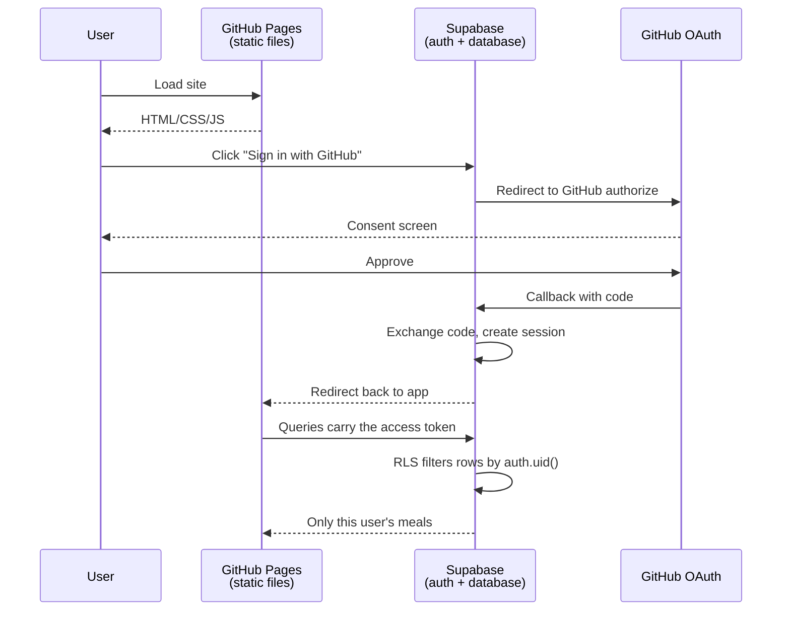

# Lifestyle Tracker

A static lifestyle and habit tracker. A dashboard shows today at a glance; the calorie
tracker lets you build a meal from ingredients, see the totals and the per-100 g
breakdown, and save it to a private history. Habits, health, exercise, sleep, water and
mood have their database tables in place and their screens are next.

No build step, no bundler, no framework. Plain HTML, CSS and ES modules, hosted on
GitHub Pages with Supabase as the database.

**Live:** https://renateche.github.io/CaloryTracker/

---

## Table of contents

- [What it does](#what-it-does)
- [How the maths works](#how-the-maths-works)
- [Where data is stored](#where-data-is-stored)
- [Project structure](#project-structure)
- [Adding a new tracker](#adding-a-new-tracker)
- [How GitHub and Supabase connect](#how-github-and-supabase-connect)
- [Security model](#security-model)
- [Running it locally](#running-it-locally)
- [Setting it up from scratch](#setting-it-up-from-scratch)
- [Deploying](#deploying)
- [Troubleshooting](#troubleshooting)

---

## What it does

**Dashboard** (`index.html`) — the landing page

- One tile per tracker showing today's total, linking through to that tracker
- Signed out, it shows a short intro and a sign-in button instead of data
- Queries every tracker table in parallel for the current local day

**Calorie tracker** (`calories.html`)

1. Enter an ingredient: name, calories per 100 g, amount in grams, and optionally
   protein / carbs / fat per 100 g.
2. The ingredient is added to a table showing its _actual_ contribution.
3. Amounts can be edited inline; rows can be removed.
4. Totals and per-100 g values update live.
5. Signed-in users can name the meal and save it to history.

**Calorie history** (`calories-history.html`)

- Filter by date range (defaults to the last 30 days)
- Meals grouped by calendar day with daily totals
- Summary stats and a calories-per-day line chart drawn on `<canvas>`
- Reload an old meal back into the builder, or delete it

**Planned trackers** — `habits.html`, `health.html`, `exercise.html`, `sleep.html`,
`water.html`, `mood.html`. Each has its tables, indexes and RLS policies already
created, plus a placeholder screen so no navigation link is dead.

---

## How the maths works

Ingredients are stored as **values per 100 g** plus the **amount used**. Actual values
are always derived, never stored, so editing an amount can never desynchronise the data.

For each ingredient:

```
actual_value = value_per_100g × (amount_in_grams / 100)
```

Example — 200 g of chicken at 165 kcal/100 g:

```
165 × (200 / 100) = 330 kcal
```

Meal totals are the sum of every ingredient's actual values. The whole-meal per-100 g
figures divide back out by total weight:

```
meal_value_per_100g = (total_value / total_weight) × 100
```

All of this lives in `nutrition.js` and is shared by both pages.

---

## Where data is stored

There are three distinct stores, and they hold different things.

### 1. Browser `localStorage` — work in progress

| Key                        | Contents                                             |
| -------------------------- | ---------------------------------------------------- |
| `lifestyle:calories:draft` | Array of ingredient objects for the in-progress meal |

- Keys are namespaced `lifestyle:<tracker>:draft` by `js/lib/storage.js`
- Written on every add / edit / remove; read on page load so a refresh never loses work
- **Per browser, per device.** Not synced. Cleared by "clear site data"
- Also the handoff channel when History's "Load" button pushes a saved meal back into
  the builder
- The pre-rename key `meal-calculator:ingredients` is migrated automatically on first
  load and then removed

### 2. Supabase Postgres — saved history

One table per tracker, all following the same shape: a `user_id` FK to `auth.users`
defaulting to `auth.uid()`, an index on `(user_id, <date column> desc)`, RLS enabled
and four policies.

| Table            | Date column   | Holds                                     |
| ---------------- | ------------- | ----------------------------------------- |
| `meals`          | `eaten_at`    | Saved meals, ingredients as `jsonb`       |
| `habits`         | `created_at`  | Habit definitions (name, cadence, target) |
| `habit_entries`  | `entered_on`  | One row per habit per day                 |
| `health_metrics` | `measured_at` | Weight, waist, blood pressure, resting HR |
| `workouts`       | `started_at`  | Activity, duration, intensity, calories   |
| `sleep_entries`  | `slept_at`    | Sleep and wake times, quality             |
| `water_entries`  | `drunk_at`    | Individual drinks in millilitres          |
| `mood_entries`   | `entered_on`  | One mood score per day                    |
| `user_settings`  | —             | Timezone, daily targets, weight unit      |

`public.meals` in detail:

| Column           | Type            | Notes                                                 |
| ---------------- | --------------- | ----------------------------------------------------- |
| `id`             | `uuid`          | Primary key, auto-generated                           |
| `user_id`        | `uuid`          | FK to `auth.users`, defaults to `auth.uid()`          |
| `name`           | `text`          | Meal name, defaults to `'Meal'`                       |
| `eaten_at`       | `timestamptz`   | When the meal was eaten                               |
| `ingredients`    | `jsonb`         | Full ingredient array, constrained to be a JSON array |
| `total_weight`   | `numeric(10,2)` | Denormalised totals so the history page and           |
| `total_calories` | `numeric(10,2)` | chart never have to unpack the JSONB                  |
| `total_protein`  | `numeric(10,2)` |                                                       |
| `total_carbs`    | `numeric(10,2)` |                                                       |
| `total_fat`      | `numeric(10,2)` |                                                       |
| `created_at`     | `timestamptz`   | Insert timestamp                                      |

### 3. Supabase Auth — the session

`supabase-js` persists the session in `localStorage` under its own `sb-*` keys and
refreshes the access token automatically. Nothing in this app touches those keys
directly.

---

## Project structure

```
index.html                 Dashboard (landing page)
calories.html              Meal builder
calories-history.html      Meal history
habits.html health.html exercise.html sleep.html water.html mood.html
                           Placeholder screens for planned trackers
style.css                  All styling, including dark mode
config.js                  Supabase URL + publishable key

js/lib/format.js           toNumber, format, createId
js/lib/dom.js              escapeHtml, setStatus, delegated actions
js/lib/dates.js            Local-timezone day keys and ranges
js/lib/storage.js          Namespaced localStorage + legacy migration
js/lib/chart.js            Canvas line chart

js/api/client.js           Lazy Supabase client, GitHub OAuth
js/api/tracker-api.js      createTrackerApi({ table, dateColumn, dateType })

js/app/trackers.js         Tracker registry — nav, tiles and tables read from here
js/app/shell.js            Injects header, nav and auth bar into every page
js/app/auth-bar.js         Sign-in bar behaviour

js/features/dashboard.js   Today's tiles
js/features/stub.js        Placeholder page controller
js/features/calories/      nutrition.js, api.js, builder.js, history.js

supabase/migrations/       0001 meals, 0002 foundation, 0003 trackers, 0004 policies
```

### Module dependency graph

```mermaid
graph TD
    P[Any page] --> SH[app/shell.js]
    SH --> TR[app/trackers.js]
    SH --> AB[app/auth-bar.js]
    AB --> CL[api/client.js]
    DASH[features/dashboard.js] --> SH
    DASH --> TA[api/tracker-api.js]
    DASH --> TR
    CAL[features/calories/builder.js] --> SH
    CAL --> NUT[features/calories/nutrition.js]
    CAL --> CAPI[features/calories/api.js]
    HIST[features/calories/history.js] --> SH
    HIST --> CAPI
    HIST --> CH[lib/chart.js]
    CAPI --> TA
    CAPI --> TR
    TA --> CL
    TA --> DT[lib/dates.js]
    CL --> CFG[config.js]
    CL -.CDN.-> SDK[esm.sh/@supabase/supabase-js]
```

Everything loads with `<script type="module">`. There is no bundler — the browser
resolves the imports directly, which is why a local file server is required for
development (see below).

---

## Adding a new tracker

The registry in `js/app/trackers.js` is the single source of truth. Navigation links,
dashboard tiles and table wiring all read from it.

1. Add the table, index and RLS policies in a new `supabase/migrations/*.sql` file
2. Add an entry to `TRACKERS` with `key`, `label`, `href`, `accent`, `unit`, `table`,
   `dateColumn`, `dateType`, `ready` and a `summarise(rows)` function
3. Add `--accent-<key>` and `.accent-<key>` to `style.css`
4. Replace the placeholder HTML page with a real screen, backed by
   `createTrackerApi(getTracker('<key>'))`
5. Flip `ready` to `true`

Steps 1–3 are enough to make the tracker appear on the dashboard with live data.

---

## How GitHub and Supabase connect

Three separate systems are involved. They are wired together by URLs, and every URL
has to match or authentication breaks.



### The three roles

| System                          | Responsibility                                                                |
| ------------------------------- | ----------------------------------------------------------------------------- |
| **GitHub (repository + Pages)** | Stores the source and serves the static files. Knows nothing about your data. |
| **GitHub (OAuth App)**          | Identity provider. Confirms who you are; never sees your meals.               |
| **Supabase**                    | Handles the OAuth exchange, issues sessions, stores meals, enforces RLS.      |

### The URLs that must line up

| Setting                    | Where                                          | Value                                                                     |
| -------------------------- | ---------------------------------------------- | ------------------------------------------------------------------------- |
| Authorization callback URL | GitHub OAuth App                               | `https://lxdepwhjjuwdtawzzzrm.supabase.co/auth/v1/callback`               |
| Homepage URL               | GitHub OAuth App                               | `https://renateche.github.io/CaloryTracker/`                              |
| Client ID + Secret         | Supabase → Auth → Sign In / Providers → GitHub | from the OAuth App                                                        |
| Site URL                   | Supabase → Auth → URL Configuration            | `https://renateche.github.io/CaloryTracker/`                              |
| Redirect URLs              | Supabase → Auth → URL Configuration            | `https://renateche.github.io/CaloryTracker/**`<br>`http://localhost:*/**` |
| `SUPABASE_URL`             | `config.js`                                    | `https://lxdepwhjjuwdtawzzzrm.supabase.co`                                |
| `SUPABASE_ANON_KEY`        | `config.js`                                    | the publishable key                                                       |

Note the callback points at **Supabase**, not at the app. GitHub hands the
authorization code to Supabase, Supabase exchanges it for a session, and only then
does the user get bounced back to the app.

Deployment is just `git push` — GitHub Pages rebuilds from `main` automatically.
There is no build pipeline and no server-side code anywhere.

---

## Security model

**The publishable key in `config.js` is public, and that is fine.** It ships in the
JavaScript bundle and anyone can read it. It is designed for this.

What makes it safe is **Row Level Security**. With RLS enabled and policies in place,
that key grants access to nothing until a valid user session exists, and then only to
that user's own rows.

```sql
alter table public.meals enable row level security;

create policy "read own meals" on public.meals
  for select to authenticated using ((select auth.uid()) = user_id);
-- plus matching insert / update / delete policies
```

The `to authenticated` clause rejects anonymous requests before the row check runs, and
wrapping `auth.uid()` in a scalar subquery lets Postgres evaluate it once per statement
instead of once per row.

Consequences worth understanding:

- Reads in `js/api/tracker-api.js` deliberately carry **no client-side `user_id`
  filter**. Filtering in the client would be cosmetic; the database enforces isolation.
- If RLS were disabled, the public key would expose the entire table to the internet.
  Verify the **"RLS policies"** badge shows **4** on every table in the Table Editor.
- **Never put the `service_role` key in this repo.** It bypasses RLS entirely.

---

## Running it locally

ES modules cannot be loaded over `file://` — opening `index.html` directly will fail
with a CORS error. Use any static server:

```powershell
npx serve .
# or
python -m http.server 8000
```

Then open the printed `http://localhost:<port>` URL. `http://localhost:*/**` is already
in the Supabase redirect allow list, so sign-in works locally too.

---

## Setting it up from scratch

For a fresh clone pointing at your own Supabase project:

1. **Database** — Supabase → SQL Editor. Run each file in `supabase/migrations/` in
   numeric order, pasting the **whole** file each time. Every script is written to be
   safe to re-run. Confirm each table then shows 4 RLS policies.
2. **GitHub OAuth App** — github.com → Settings → Developer settings → OAuth Apps → New.
   Callback URL must be `https://<your-project-ref>.supabase.co/auth/v1/callback`.
3. **Enable the provider** — Supabase → Authentication → Sign In / Providers → GitHub.
   Paste the Client ID and Secret, enable, save.
4. **URL configuration** — Supabase → Authentication → URL Configuration. Set the Site
   URL and add both redirect URL patterns.
5. **`config.js`** — replace `SUPABASE_URL` and `SUPABASE_ANON_KEY` with your project's
   values from Project Settings → API.
6. **Pages** — repo → Settings → Pages → Deploy from a branch → `main` → `/ (root)`.

Until step 5 is done the app still runs; the auth bar simply reports that Supabase is
not configured and the save button stays disabled.

---

## Deploying

```powershell
git add -A
git commit -m "Your message"
git push
```

GitHub Pages redeploys automatically. Progress is visible in the repo's **Actions** tab
under "pages build and deployment".

Because the files are plain static assets with no content hashing, **browsers and the
GitHub Pages CDN will cache them**. After a deploy, hard-reload with `Ctrl+Shift+R` to
be sure you are running the new version.

---

## Troubleshooting

| Symptom                                      | Cause                                                      | Fix                                                                    |
| -------------------------------------------- | ---------------------------------------------------------- | ---------------------------------------------------------------------- |
| "Supabase is not configured"                 | `config.js` still has placeholders, or a stale cached copy | Fill in the values; hard-reload. Check `/config.js` directly in a tab. |
| Sign-in redirects then errors                | App URL missing from Supabase Redirect URLs                | Add `https://.../**` under URL Configuration                           |
| `Unsupported provider`                       | GitHub provider not enabled in Supabase                    | Enable it and save the Client ID/Secret                                |
| `new row violates row-level security policy` | Session missing, or `user_id` mismatch                     | Confirm you are signed in; re-run the migrations                       |
| History always empty                         | A migration ran without its RLS half                       | Re-run the whole migration file, top to bottom                         |
| Dashboard tile says "Not set up yet"         | That tracker's migration has not been run                  | Run `0003_trackers.sql`                                                |
| Blank page, console CORS error               | Opened over `file://`                                      | Serve over HTTP instead                                                |
| Changes not appearing after push             | CDN / browser cache                                        | Hard-reload, or wait ~10 minutes                                       |

For auth failures specifically, Supabase → Logs → Auth Logs shows the server side of
the exchange, which is usually more informative than the browser console.
